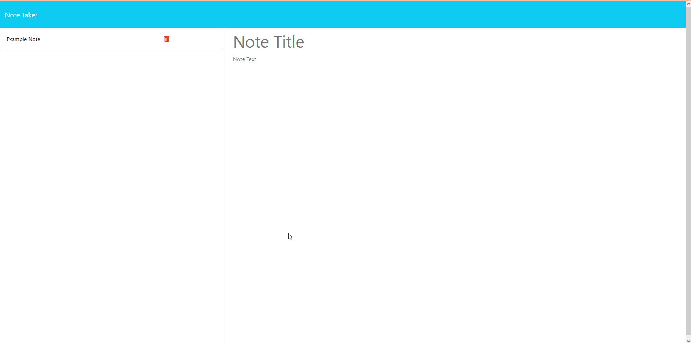

# Express.js Note Taker

## Description

A note taker using a local server hosted by node.js

## Installation

N/A

## Usage

Install Node.JS, then in your terminal navigate to the project folder and type "npm i -y" and then "npm start"

## Credits

Coded By: Seth Correa (Seth the Furboi)

## License

Please refer to the LICENSE in the repo.